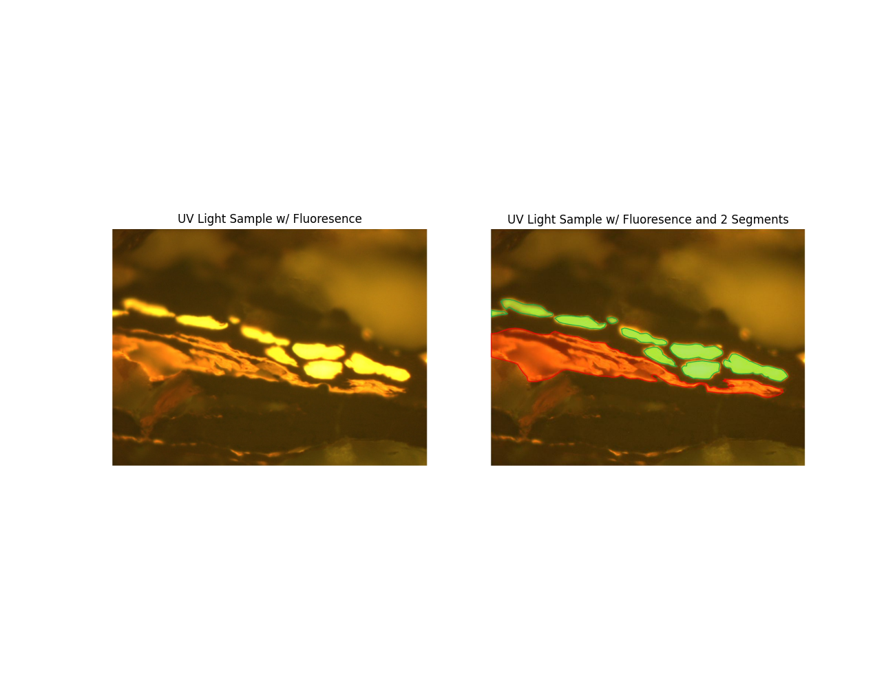
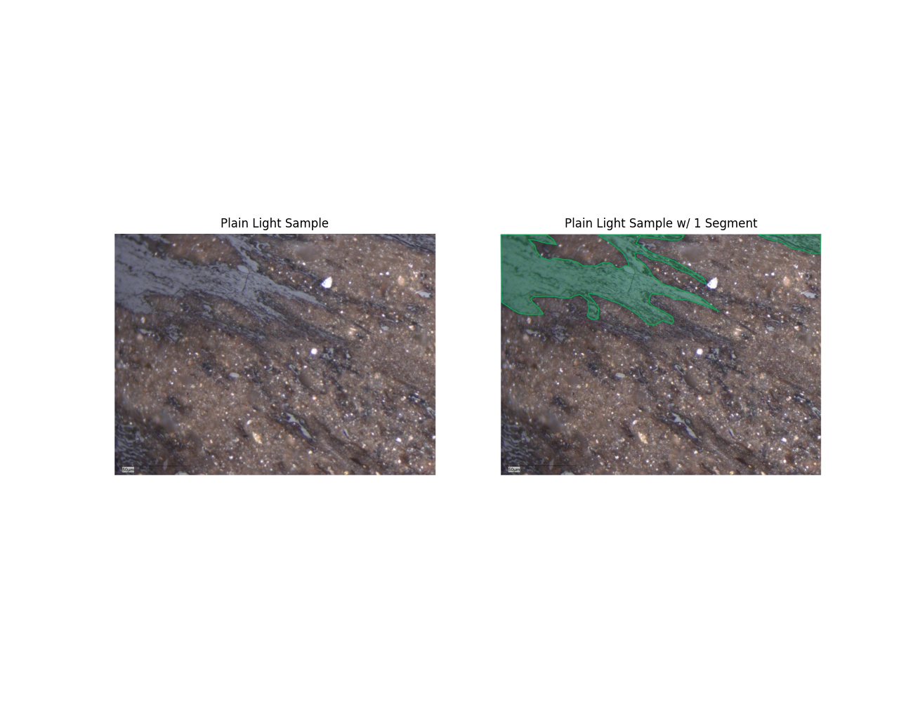
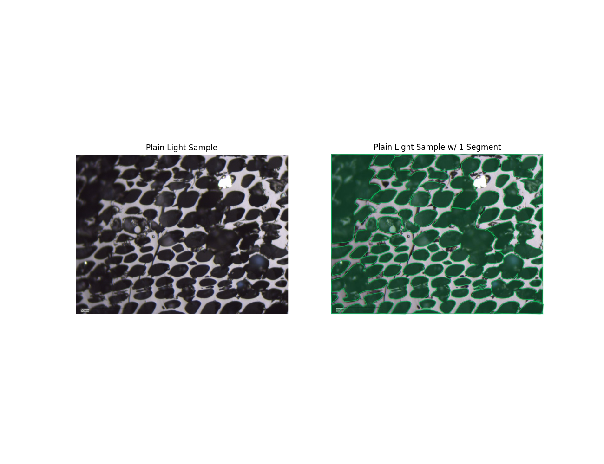
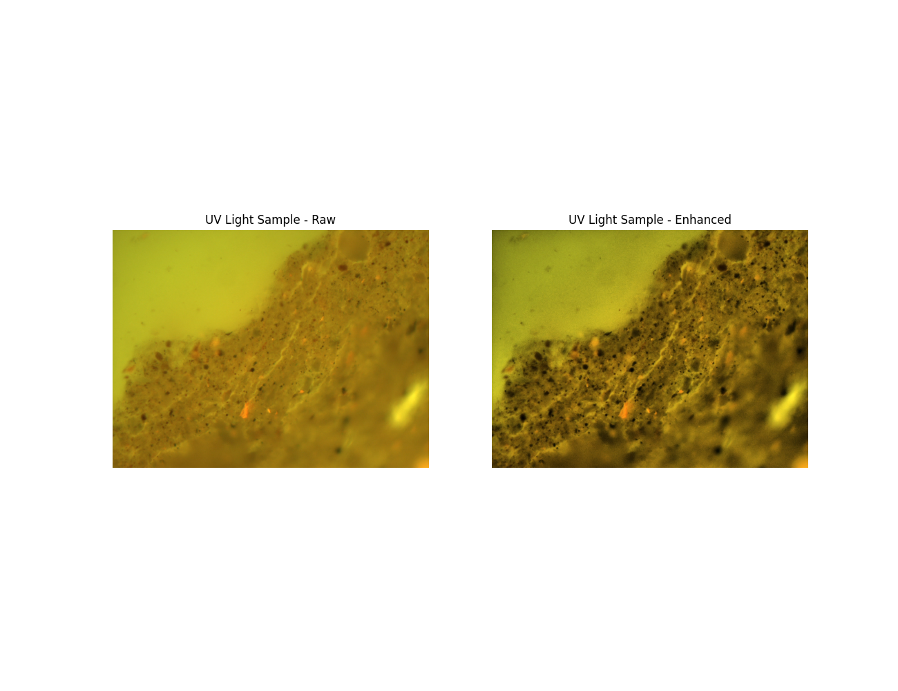
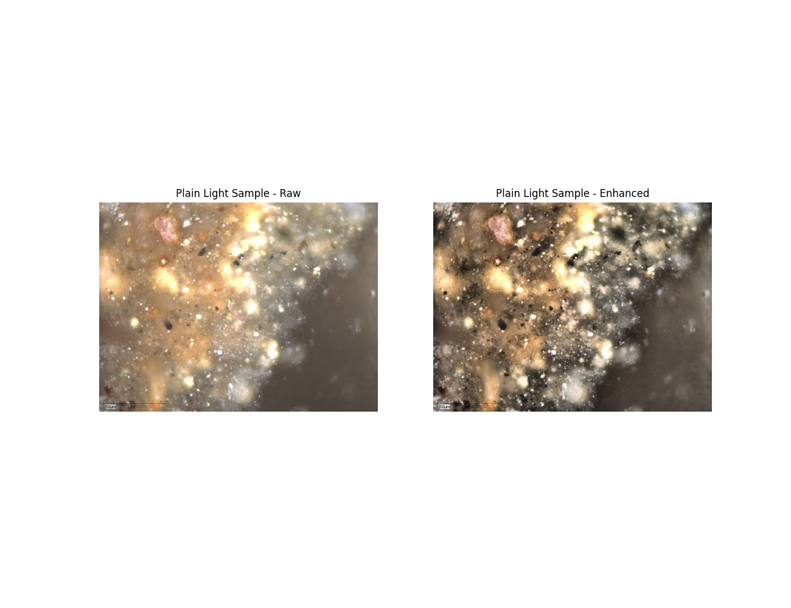
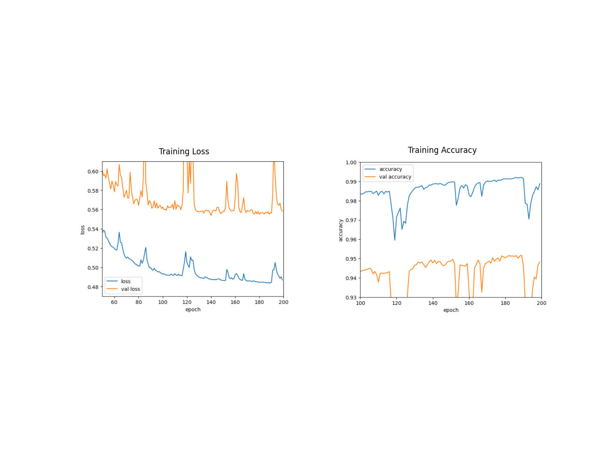
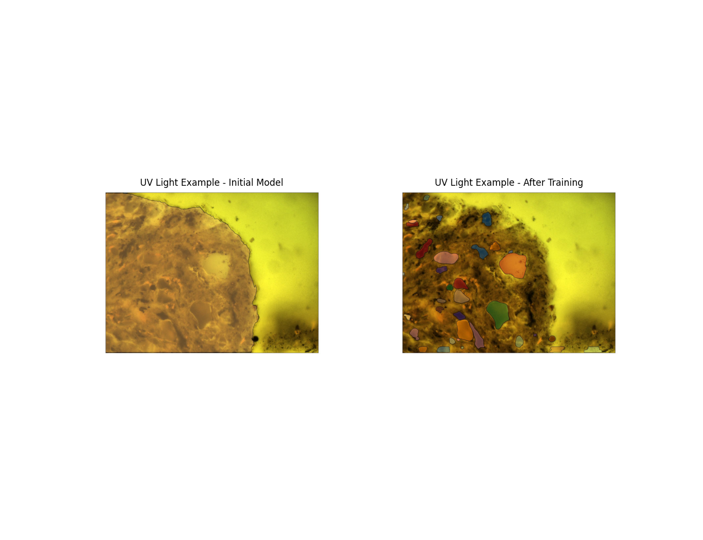
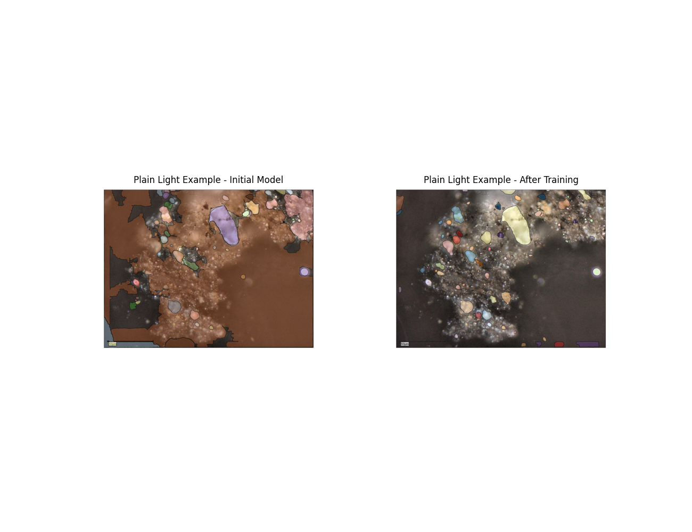

# stranger-sections

This project was completed as part of the Studio X Xeek Challenge: [Stranger Sections: Segmenting Mysterious Objects Through the Microscope](https://xeek.ai/challenges/stranger-sections)

The challenge is to provide a model which can accurately segment blobs on 1000 unlabeled thin sections. The thin section images include both plain-light and ultraviolet light.

# Data

As mentioned above, the dataset consists of 1000 unlabeled thin section images. Some of these images are be plain light images and others are UV light. There are various blobs on on each thin section image that need to be segmented. Below are 3 examples showing how one might segment the images. The examples show the three types of blobs found on the images. As you'll see, there are potentially more segments on the image than what is currently provided.

# Approach

To solve this problem, I utilized the [segmenteverygrain](https://github.com/zsylvester/segmenteverygrain/tree/main) model. `segmenteverygrain` is built using Meta's [Segment Anything Model (SAM)](https://github.com/facebookresearch/segment-anything).  SAM can create masks for all objects in an image, but requires the use of input prompts such as points or boxes.  `segmenteverygrain` builds on this by utilizing a Unet-style, patch-based convolutional neural network to create a first-pass segmentation, which is then used as the set of prompts for the SAM-based segmentation.

The issue is that the out-of-the-box segmenteverygrain model had poor performance with these examples.  I took 2 approaches to solve this problem:

1. Image enhancement.  Many of the images in this project had poor contrast. I enhanced the brightness and contrast of the images utilizing [adaptive histogram equalization](https://scikit-image.org/docs/stable/api/skimage.exposure.html#skimage.exposure.equalize_adapthist), which performs local contrast enhancement using histograms computed over different tile regions of the images. This greatly improved the ability of the ML algorithm to identify the grains in the images.

2. Model Training.  After image enhancement, the model performance on these images was still poor.  In general, it often tended to lump together large portions of the image as a single grain, segment blurry/out of focus areas as grains, and was not able to segment interior grains or more subtle grains.  In order to improve model performance, I modified the output labels for **40** images, and then trained the model on these images. For training, the images were broken into tiles (40 images, at 63 tiles per image, for a total of 2520 tiles and corresponding masks). The training tiles were broken into training, validation, and test sets (50% training, 25% validation, and 25% test). Training was performed using 200 epochs, with a final validation loss and accuracy of **0.5582** and **0.9482**, respectively.

# Running the Code

The prediction code is in the jupiter notebook named *ara_starter_notebook_v1.ipynb*. A *requirements.txt* file is included for setting up your environment. Starting at the section labelled **Code**, there are two cells that must be run.  The first one downloads the model checkpoint, and must only be run once. The second cell will peform the labeling predictions for all of the images. Place the images to be labelled in a folder in your project directory named:

*images/input/*

The notebook will create a folder in the project named *output/* and will save the output masks there as numpy arrays in *.npy* format.